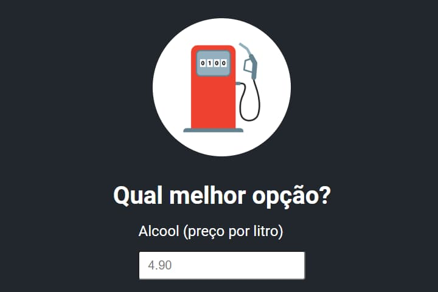

# Calculadora - Álcool ou Gasolina

</img>

## Projeto

Projeto com intuito de demonstrar/ensinar sobre HTML, CSS e JavaScript, através da criação de um projeto.

Para acessar o projeto, basta [clicar aqui](https://danieldpalma.github.io/calculadora-alcool-gasolina/)

Projeto criado no mini curso de HTML, CSS e JavaScript do [Sujeito Programador](https://www.instagram.com/sujeitoprogramador/).

## Tecnologias

Para este projeto foram utilizados as seguintes tecnologias:

- HTML
- CSS
- JavaScript
